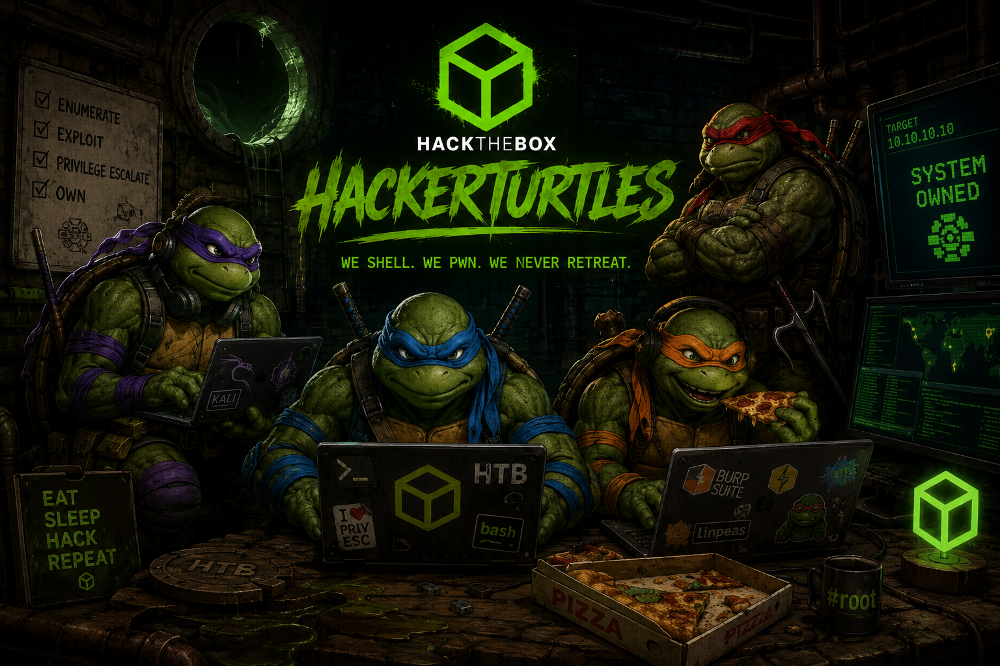

# HackerTurtles

Community-/Lernseite unserer HackTheBox-Crew. Statische Seite für GitHub Pages
im Warez-/Matrix-/Cyberpunk-Stil.

## Dateien

```
index.html      # Startseite (Gruppenbild + Übersicht)
crew.html       # Mitglieder
stats.html      # HTB-Stats
writeups.html   # Writeup-Archiv + Upload-Formular
lernpfad.html   # Roadmap
tools.html      # Tools & Lab-Setup
kontakt.html    # Kontakt & Regeln
style.css       # gemeinsames Design
matrix.js       # Matrix-Regen
writeups.js     # Upload-Logik (GitHub-Deep-Link, Download, Liste)
writeups/       # hier landen die .md-Writeups
```

## Deploy auf GitHub Pages

1. Repo anlegen (z.B. `hackerturtles`) und diese Dateien hochladen.
2. Repo → **Settings → Pages** → Source: `Deploy from a branch` → Branch `main` / `/root`.
3. Nach ein paar Minuten ist die Seite unter
   `https://DEIN-GITHUB-NAME.github.io/hackerturtles/` erreichbar.

## Konfiguration

Oben in **`writeups.js`** eintragen:

```js
const REPO_OWNER  = "DEIN-GITHUB-NAME";
const REPO_NAME   = "hackerturtles";
const REPO_BRANCH = "main";
const WRITEUP_DIR = "writeups";
```

## Gruppenbild einsetzen

In `index.html` den Platzhalter-Block ersetzen:

```html
<section class="hero-img frame">
  
</section>
```

## Wie funktioniert der Writeup-Upload?

Bewusst **ohne Token in der Seite** (GitHub Pages ist Static Hosting – ein Token
im Client-JS wäre öffentlich lesbar und damit ein Schreibrecht-Leak).

Stattdessen baut das Formular die fertige `.md`-Datei und öffnet GitHubs eigenen
`new file`-Editor mit vorausgefülltem Inhalt. Jede*r ist dort mit dem **eigenen**
Login angemeldet:

- Schreibrechte am Repo → direkter Commit.
- Keine Schreibrechte → GitHub legt automatisch Fork + Pull Request an (Review-Flow).

Fallback für sehr lange Writeups: „Als .md herunterladen" und die Datei manuell
in `writeups/` hochladen.

## Rechtliches

Nur für legales Training in autorisierten Lab-Umgebungen (HackTheBox, TryHackMe,
eigene VMs). Kein Testen gegen fremde oder Produktivsysteme.
